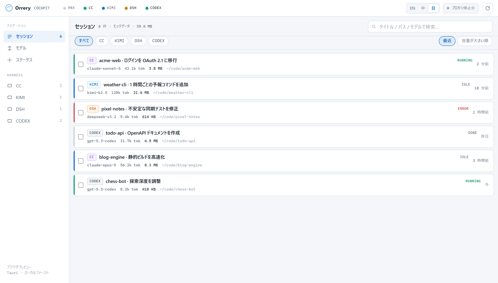
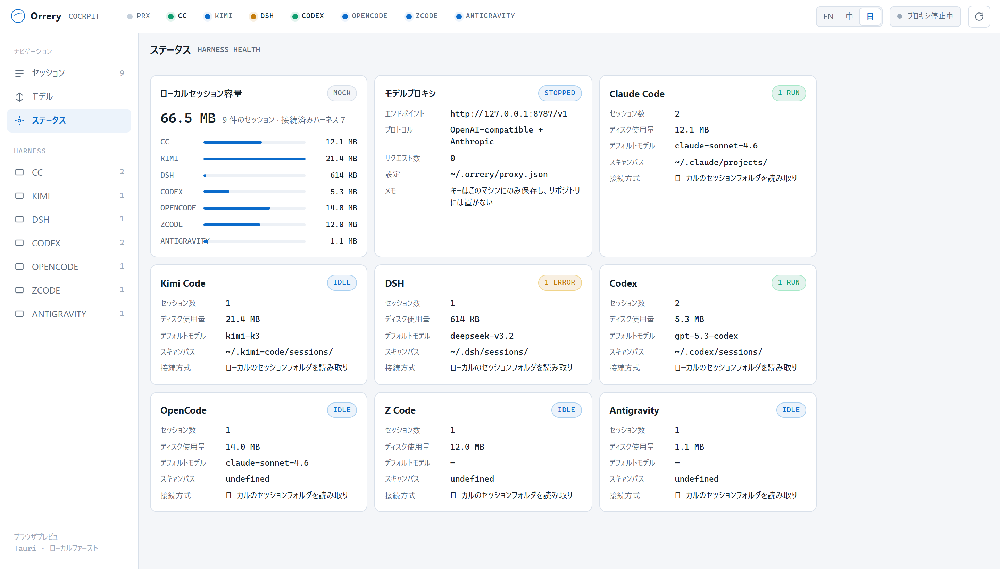
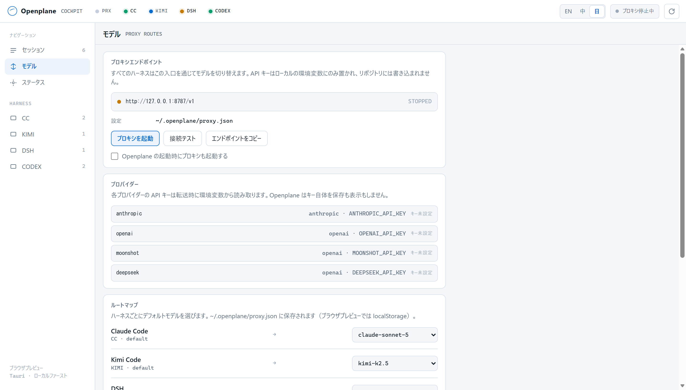
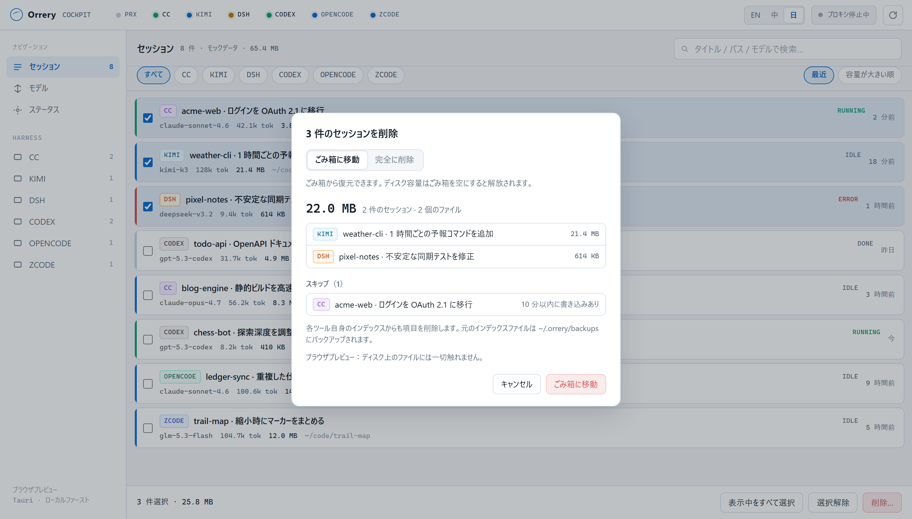

<div align="center">


# Orrery

**AI コーディングエージェントのための、ローカルファーストなコックピット。**

*Orrery（オーラリー）は太陽系儀のこと。複数の天体がひとつの装置の中でそれぞれの軌道を回り、ひとところから全体を読み取れます。*

手元の Claude Code・Kimi Code・DSH（DeepSeek）・Codex のセッションをひとつのウィンドウに集約します。トークン、ディスク使用量、プロジェクト、サブエージェントまで一目で把握でき、不要なセッションは削除でき、各ハーネスをひとつのローカルモデルプロキシ経由にまとめられます。データは PC の外に出ません。

<p>
  <a href="https://github.com/arvelvale/orrery/releases/latest"></a>
  <a href="https://github.com/arvelvale/orrery/blob/main/LICENSE"></a>
  <a href="https://github.com/arvelvale/orrery/stargazers"></a>
  <a href="https://github.com/arvelvale/orrery/commits/main"></a>
</p>
<p>
  
  
  
  
  
  
</p>
<p>
  
  
  
  
</p>

[English](README.md) · [简体中文](README.zh-CN.md) · **日本語**



</div>

> [!NOTE]
> UI は English・简体中文・日本語に対応し、システム言語に自動で合わせます。トップバーからいつでも切り替えられます。スクリーンショットは架空のプロジェクトを使ったモックデータです。

## なぜ作ったか

複数のエージェントツールを並行して使っていると、毎日同じ不便にぶつかります。

1. **セッションがバラバラ**：ツールごとに JSONL やセッションフォルダの形式が違い、横断して検索・比較・再開できません。
2. **使用量が見えない**：そのセッションで実際に何トークン使ったのか。何百もの会話ログがディスクをどれだけ占めているのか。
3. **モデル切り替えが手作業**：ツールごとに環境変数と設定ファイルが別々です。

Orrery は、各ツールがすでにディスクへ書き出しているデータを読み取り、ひとつのボードにまとめます。エージェントのラップ、フォーク、再実装は一切しません。

## 現在できること

| 機能 | 状態 | 備考 |
|---|:---:|---|
| セッションハブ：Claude Code | ✅ | `~/.claude/projects`、サブエージェントは親セッションに統合 |
| セッションハブ：Kimi Code | ✅ | `~/.kimi-code/sessions`、新旧両方の `state.json` 形式に対応 |
| セッションハブ：DSH（DeepSeek） | ✅ | `~/.dsh/sessions`、zstd 圧縮のイベントログ、v0 / v3 形式に対応 |
| セッションハブ：Codex | ✅ | `~/.codex/sessions`、同じ id の rollout を統合、guardian サブエージェントは親セッションに統合 |
| 正確なトークン集計 | ✅ | API 呼び出し単位で重複排除し、入力 / キャッシュ書込 / キャッシュ読込 / 出力に分割 |
| セッション別・ハーネス別のディスク使用量 | ✅ | ステータス画面に合計と内訳を表示 |
| タイトル・パス・モデルで検索 | ✅ | |
| UI 三言語対応：English / 简体中文 / 日本語 | ✅ | システム言語に追従、トップバーで切り替え |
| 高速起動 | ✅ | 解析結果をディスク上のインデックスに保存し、再起動後は変更されたファイルだけ読み直します（188 セッションで 5.5 秒 → 0.12 秒）|
| セッションを削除してディスクを空ける | ✅ | 1 件または複数選択、容量順に並べ替え可；ごみ箱または完全削除；各ツールのインデックスも整理 |
| ローカルモデルプロキシ（`127.0.0.1:8787`） | ✅ | 実際に転送します。OpenAI / Anthropic 両形式、ストリーミング透過、アプリから起動・停止 |
| ターミナルで再開 | ⏳ | 現状はセッションフォルダを開くだけ |



## トークンの数え方

どのツールも API 呼び出しごとに使用量を記録しますが、そのまま足し合わせられるものはありません。

| | 取得元 | 落とし穴 | Orrery の処理 |
|---|---|---|---|
| **Claude Code** | assistant 行の `message.usage` | ストリーミング時にコンテンツブロックごとに行が分かれ、同じ使用量が重複する（あるセッションでは 4,034 行が実際には 1,558 回の呼び出し） | `message.id` で重複排除し、最後の行を採用 |
| **Kimi Code** | `agents/*/wire.jsonl` 内の `usage.record` イベント | `usageScope: "session"` はコンテキスト圧縮の独立した呼び出しで、合計値ではない | 各レコードを 1 回ずつ集計 |
| **DSH** | マルチフレーム zstd ログ内の `assistant/message` イベントの `data.usage` | アップグレードしたセッションには同じ履歴の v0 と v3 のログが両方残る | 両方ある場合は v3 のみ読む |
| **Codex** | `token_count` イベント（新しい版では `token_usage_record` も） | `total_token_usage` はプロセス単位で再開時にリセット、`input_tokens` はキャッシュ分を含む、古い `token_count` はコンテキスト圧縮の呼び出しを記録しない | 呼び出し単位で重複排除して合算し、`token_usage_record` がある区間はそちらを優先、入力からキャッシュ分を差し引く |

セッション合計は、メインエージェントとすべてのサブエージェントの和です。検証方法：

- **Claude Code**：同じプロセス区間で自身の `cost-state` 記録と照合し、入力・キャッシュ読込・出力が完全に一致。
- **DSH**：DSH 自身の投影キャッシュと、キャッシュ作成時点までのイベントで完全に一致。
- **Codex**：両方の記録を持つ 12 ファイル中 8 ファイルで完全一致。残り 4 ファイルの差はちょうどコンテキスト圧縮の呼び出し分。

初期の Codex alpha 版のセッションは内訳のない合計値しか持たないため、推測せず「内訳なし」として表示します。

既知の制限：公式記録は `--resume` でリセットされるため、Orrery は会話ログから合計を再構築しています。公式記録にはタイトル生成など会話ログに残らない副次的な呼び出しも含まれるため、Orrery の Claude Code 合計は 1〜5% ほど少なく出ることがあります。

## はじめに

**すぐ使いたい場合**は[最新リリース](https://github.com/arvelvale/orrery/releases/latest)から `Orrery_x.y.z_x64-setup.exe` をダウンロードしてください（Windows 10/11 x64、管理者権限不要）。コード署名をしていないため SmartScreen の確認が出ます。「詳細情報 → 実行」で進めるか、リリースノートの SHA-256 で検証してください。

**必要なもの（Windows）**

- [Rust](https://rustup.rs)（MSVC ツールチェーン）
- [Visual Studio Build Tools](https://aka.ms/vs/17/release/vs_BuildTools.exe)（MSVC と Windows SDK）
- Node.js 18+
- WebView2（Windows 10/11 に標準搭載）

```powershell
git clone https://github.com/arvelvale/orrery.git
cd orrery
npm install
npm run dev        # デスクトップアプリ。実際のセッションを読み込む
```

UI だけ見たい場合は Rust 不要です。

```powershell
npm run preview    # http://127.0.0.1:1420（モックデータ）
```

> [!TIP]
> Rust のビルドは Git Bash ではなく PowerShell で実行してください。Git には同名の `link.exe` が同梱されていますが、MSVC のリンカーではありません。

## ディレクトリ構成

```text
orrery/
├─ ui/                      # index.html · styles.css · app.js · i18n.js（WebView とブラウザで共用）
├─ src-tauri/
│  └─ src/
│     ├─ adapters/
│     │  ├─ mod.rs          # SessionSummary、TokenUsage、キャッシュ、共通処理
│     │  ├─ claude_code.rs
│     │  ├─ kimi_code.rs
│     │  ├─ dsh.rs
│     │  ├─ codex.rs
│     │  └─ cleanup.rs      # セッション削除とインデックス整理
│     ├─ proxy/             # ローカルモデルプロキシ
│     │  ├─ mod.rs         # 起動・停止・状態
│     │  ├─ config.rs      # プロバイダーとルート（~/.orrery/proxy.json）
│     │  ├─ server.rs      # HTTP 面と上流への転送
│     │  └─ state.rs       # カウンター、直近のリクエストとエラー
│     └─ lib.rs             # Tauri コマンド
├─ scripts/preview.mjs      # 依存ゼロの静的プレビュー
├─ docs/                    # 設計ドキュメント（中国語）
└─ DESIGN.md                # ビジュアル仕様
```

## ローカルモデルプロキシ

ハーネスの接続先を `http://127.0.0.1:8787/v1` にすると、Orrery がリクエストを上流へ転送します。モデルの切り替えは各ツールの設定を編集せず、アプリ上で行えます。



| | |
|---|---|
| エンドポイント | `POST /v1/chat/completions`（OpenAI 形式）· `POST /v1/messages`（Anthropic 形式）· `GET /v1/models` · `GET /health` |
| モデルのルーティング | `x-orrery-harness: <id>` を付けると、「モデル」画面でそのハーネスに設定したモデルに `model` を書き換えます。ヘッダーがなければリクエストのモデルをそのまま使います |
| プロバイダーの選択 | モデル名の接頭辞で判定（`claude*` → anthropic、`kimi*` → moonshot など）。一致しない場合は明示的にエラーにし、別のプロバイダーで代替はしません |
| ストリーミング | SSE はチャンク単位でそのまま透過し、バッファリングしません |
| キー | 転送時に環境変数から読み取ります。Orrery は保存・記録・表示のいずれもせず、設定には変数**名**のみを保持します |
| バインド | ループバックのみ。ループバック以外の `listen` は起動を拒否します |

```bash
# 1. アプリから見える環境変数にキーを設定
setx ANTHROPIC_API_KEY sk-...        # Windows。設定後に Orrery を再起動

# 2. 「モデル」画面でプロキシを起動し、ハーネスの接続先を変更
set ANTHROPIC_BASE_URL=http://127.0.0.1:8787
```

プロバイダー・ルート・待ち受けアドレスは `~/.orrery/proxy.json` にあります：

```json
{
  "listen": "127.0.0.1:8787",
  "auto_start": false,
  "routes": { "cc": "claude-opus-5" },
  "providers": {
    "anthropic": {
      "base_url": "https://api.anthropic.com/v1",
      "api_key_env": "ANTHROPIC_API_KEY",
      "wire": "anthropic",
      "model_prefixes": ["claude"]
    }
  }
}
```

## セッションの削除

セッションはディスク上のファイルにすぎないので、不要になったものを Orrery から削除できます。削除前には必ず確認ダイアログが表示され、各セッションと解放される容量が一覧されます。



- **既定はごみ箱へ移動。** 完全削除は別モードで、追加のチェックが必要です。
- **使用中のセッションは保護されます。** 10 分以内に書き込みがあるもの、実行中の Claude Code で開かれているものはスキップします。
- **各ツール自身のインデックスも整理し**、無効な項目を残しません。変更前にインデックスファイルを `~/.orrery/backups/` にバックアップします。
- **Codex は公式の `codex delete` で削除し**、Codex の履歴データベースも整理します。Orrery が他のツールのデータベースに直接書き込むことはありません。
- パスはバックエンドがセッション id から解決し、そのツールのデータフォルダ内に限定されます。

| ツール | 削除するファイル | 削除するインデックス項目 |
|---|---|---|
| Claude Code | `projects/<p>/<id>.jsonl`、`projects/<p>/<id>/`、`file-history/<id>/`、`session-env/<id>/`、`tasks/<id>/` | — |
| Kimi Code | `sessions/<ws>/<id>/` | `session_index.jsonl`、`file-history/<ws>` |
| DSH | `sessions/<ws>/<id>/` とその投影キャッシュ | `storages/workspace.json` |
| Codex | セッションの rollout とそのサブエージェントの rollout | Codex データベース（`codex delete` 経由）、`session_index.jsonl` |

> [!TIP]
> セッションを削除する前に、そのツールを終了してください。実行中の Kimi Code や Codex が削除した項目をインデックスに書き戻す可能性があります。

## プライバシー

- Orrery が各ハーネスのフォルダに書き込むのは、上記のとおりセッションを削除するときだけです。
- Orrery 自身のファイルは `~/.orrery/` にあります：ルーティング設定、インデックスのバックアップ、そして `index.json`（セッションの解析結果＝タイトル・パス・トークン数のキャッシュ。再起動を速くするためのもので、削除しても次回スキャンで作り直されます）。
- 通信なし、テレメトリなし。プロキシは `127.0.0.1` のみで待ち受けます。
- 貼り付けた秘密情報を含む可能性のあるフィールド（Kimi の `lastPrompt` など）は読み取りません。

## ロードマップ

- [x] Tauri 2 シェルとセッションハブ
- [x] Claude Code・Kimi Code・DSH・Codex アダプター
- [x] トークンとディスク使用量の集計
- [x] 実際に転送するローカルモデルプロキシ
- [x] 永続インデックスによる高速起動
- [ ] 各 CLI でのセッション再開
- [ ] トレイ、グローバルショートカット、インストーラー

設計ドキュメント（中国語）：[プロジェクト概要](docs/00-项目定位.md) · [アーキテクチャ](docs/01-架构与技术路线.md) · [ロードマップ](docs/02-MVP路线图.md)
