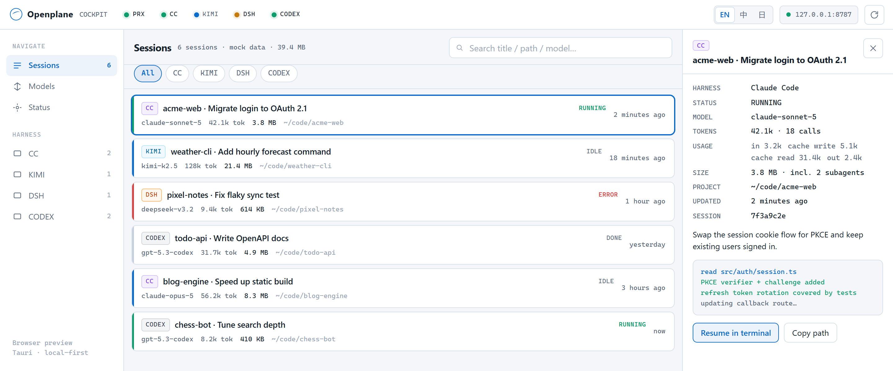

<div align="center">


# Openplane

**A local-first cockpit for your AI coding agents.**

Every Claude Code, Kimi Code, DSH (DeepSeek) and Codex session on your machine in one window: tokens, disk usage, projects, subagents. Nothing leaves your computer.

<p>
  <a href="https://github.com/arvelvale/openplane/blob/main/LICENSE"></a>
  <a href="https://github.com/arvelvale/openplane/stargazers"></a>
  <a href="https://github.com/arvelvale/openplane/commits/main"></a>
</p>
<p>
  
  
  
  
  
  
</p>
<p>
  
  
  
  
</p>

**English** · [简体中文](README.zh-CN.md) · [日本語](README.ja.md)



</div>

> [!NOTE]
> The UI speaks English, 简体中文 and 日本語. It follows your system language, and you can switch anytime from the top bar. Screenshots use built-in mock data with fictional projects.

## Why

If you run several agent harnesses side by side, you hit the same friction every day:

1. **Sessions are scattered.** Each tool keeps its own JSONL or session folder, in its own format. You can't search, compare or resume across them.
2. **Usage is invisible.** How many tokens did that session really burn? How much disk are hundreds of transcripts eating?
3. **Model switching is manual.** Every harness has its own env vars and config files.

Openplane reads what the harnesses already write to disk and puts it all on one board. It doesn't wrap, fork or re-implement any agent.

## What works today

| Capability | Status | Notes |
|---|:---:|---|
| Session hub: Claude Code | ✅ | `~/.claude/projects`, subagents folded into their parent session |
| Session hub: Kimi Code | ✅ | `~/.kimi-code/sessions`, both old and new `state.json` layouts |
| Session hub: DSH (DeepSeek) | ✅ | `~/.dsh/sessions`, zstd-compressed event logs, v0 and v3 formats |
| Session hub: Codex | ✅ | `~/.codex/sessions`, rollouts sharing an id are merged, guardian subagents folded in |
| Accurate token accounting | ✅ | Deduplicated per API call, split into input / cache write / cache read / output |
| Disk usage per session and per harness | ✅ | Status page shows totals and a per-harness breakdown |
| Search by title, path and model | ✅ | |
| UI in English / 简体中文 / 日本語 | ✅ | Follows the system language; switch from the top bar |
| Incremental rescans | ✅ | Unchanged files are served from an in-memory cache |
| Local model proxy (`127.0.0.1:8787`) | ⏳ | Route config and health probe only; no requests are forwarded yet |
| Resume in terminal | ⏳ | Currently opens the session folder |


## How token counting works

Every harness records usage per API call, and none of them can simply be added up:

| | Source | Pitfall | Openplane does |
|---|---|---|---|
| **Claude Code** | `message.usage` on assistant lines | Streaming writes one line per content block, each repeating the same usage (4,034 lines → 1,558 real calls in one session) | Deduplicates by `message.id`, keeping the last line |
| **Kimi Code** | `usage.record` events in `agents/*/wire.jsonl` | `usageScope: "session"` records are separate context-compaction calls, not totals | Counts every record once |
| **DSH** | `data.usage` on `assistant/message` events, inside multi-frame zstd logs | Upgraded sessions keep both a v0 and a v3 log of the same history | Reads only v3 when both exist |
| **Codex** | `token_count` events, plus `token_usage_record` in newer versions | `total_token_usage` is per process and resets on resume; `input_tokens` already includes cached tokens; older `token_count` misses compaction calls | Sums deduplicated per-call usage, prefers `token_usage_record` where it exists, subtracts cached tokens from input |

The session total adds up the main agent and every subagent. How it was checked:

- **Claude Code**: matches its own `cost-state` ledger exactly (input, cache read, output) over the same process window.
- **DSH**: matches DSH's own projection cache exactly up to the event the cache was built from.
- **Codex**: `token_count` and `token_usage_record` agree exactly in 8 of 12 files that have both; in the other 4 the difference is exactly the context-compaction calls.

Old Codex alpha sessions only stored a total without a breakdown. Openplane shows that part as *unsplit* instead of guessing.

Known limits: the ledger resets on `--resume`, so Openplane rebuilds totals from the transcript instead. The ledger also counts side calls that never reach the transcript, such as title generation, so Openplane's Claude Code totals can read about 1–5% lower.

## Getting started

**Requirements (Windows)**

- [Rust](https://rustup.rs) (MSVC toolchain)
- [Visual Studio Build Tools](https://aka.ms/vs/17/release/vs_BuildTools.exe) with MSVC and a Windows SDK
- Node.js 18+
- WebView2 (preinstalled on Windows 10/11)

```powershell
git clone https://github.com/arvelvale/openplane.git
cd openplane
npm install
npm run dev        # desktop app, reads your real sessions
```

Just want to look at the UI? No Rust needed:

```powershell
npm run preview    # http://127.0.0.1:1420 with mock data
```

> [!TIP]
> Run Rust builds from PowerShell, not Git Bash. Git ships its own `link.exe`, which is not the MSVC linker.

## Project layout

```text
openplane/
├─ ui/                      # index.html · styles.css · app.js · i18n.js (shared by WebView and browser)
├─ src-tauri/
│  └─ src/
│     ├─ adapters/
│     │  ├─ mod.rs          # SessionSummary, TokenUsage, cache, shared helpers
│     │  ├─ claude_code.rs
│     │  └─ kimi_code.rs
│     ├─ proxy.rs           # 8787 health probe + ~/.openplane/proxy.json
│     └─ lib.rs             # Tauri commands
├─ scripts/preview.mjs      # zero-dependency static preview
├─ docs/                    # design docs (Chinese)
└─ DESIGN.md                # visual spec
```

## Privacy

- Read-only: Openplane never writes to harness session folders.
- The only file it writes is `~/.openplane/proxy.json`, your route config.
- No network calls and no telemetry. The proxy listens on `127.0.0.1` only.
- Fields that may contain pasted secrets (for example Kimi's `lastPrompt`) are never read.

## Roadmap

- [x] Tauri 2 shell and session hub
- [x] Claude Code, Kimi Code, DSH and Codex adapters
- [x] Token and disk accounting
- [ ] Persistent index for instant cold start
- [ ] Real OpenAI-compatible / Anthropic-shaped local proxy
- [ ] Resume a session in its own CLI
- [ ] Tray, global shortcut, installer

Design docs, in Chinese: [positioning](docs/00-项目定位.md) · [architecture](docs/01-架构与技术路线.md) · [roadmap](docs/02-MVP路线图.md)
