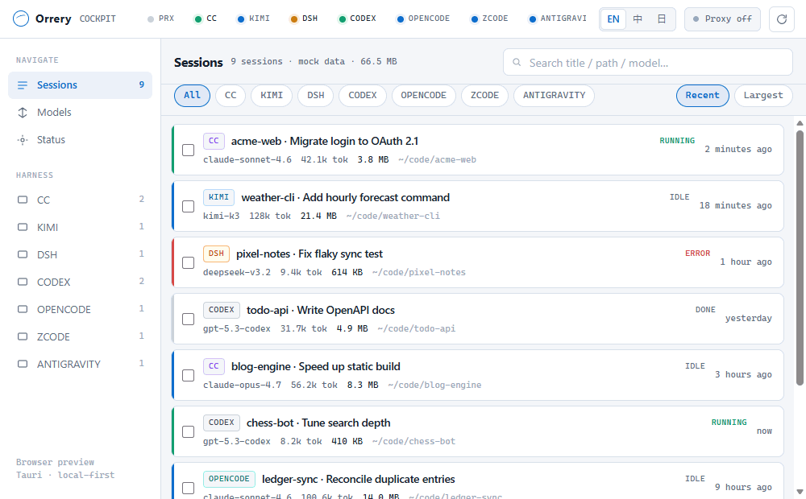
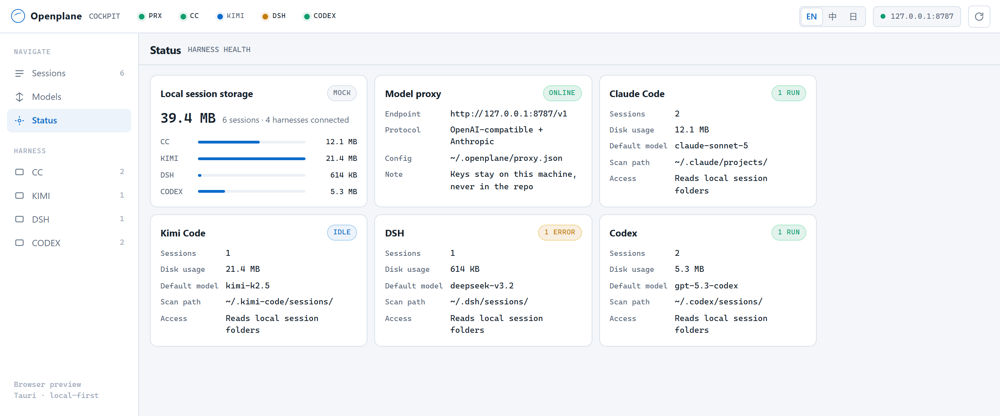
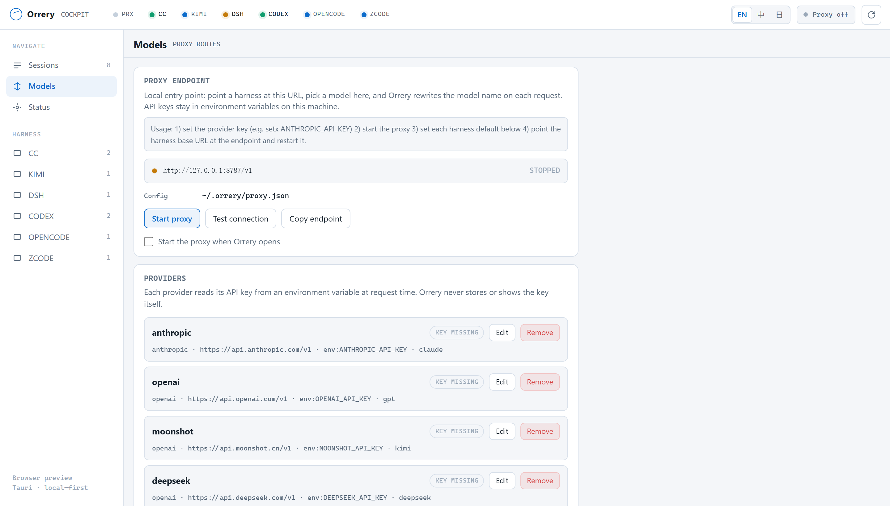
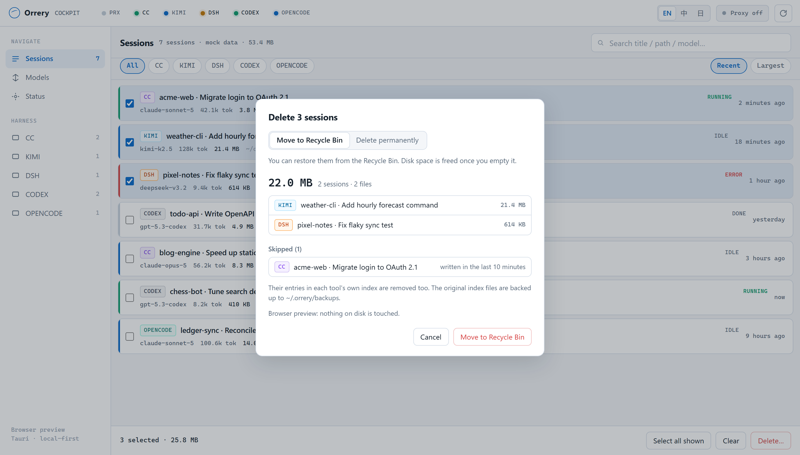

<div align="center">


# Orrery

**A local-first cockpit for your AI coding agents.**

Every Claude Code, Kimi Code, DSH (DeepSeek), Codex, OpenCode, Z Code and Antigravity session on your machine in one window: tokens, disk usage, projects, subagents. Delete what you no longer need (Z Code is read-only), and route every harness through one local model proxy. Nothing leaves your computer.

<p>
  <a href="https://github.com/arvelvale/orrery/releases/latest"></a>
  <a href="https://github.com/arvelvale/orrery/blob/main/LICENSE"></a>
  <a href="https://github.com/arvelvale/orrery/stargazers"></a>
  <a href="https://github.com/arvelvale/orrery/commits/main"></a>
</p>
<p>
  
  
  
  
  
  
</p>
<p>
  
  
  
  
  
  
  
</p>

**English** · [简体中文](README.zh-CN.md) · [日本語](README.ja.md)



</div>

> [!NOTE]
> The UI speaks English, 简体中文 and 日本語. It follows your system language, and you can switch anytime from the top bar. The demo and screenshots use built-in mock data with fictional projects.

## Why

If you run several agent harnesses side by side, you hit the same friction every day:

1. **Sessions are scattered.** Each tool keeps its own JSONL or session folder, in its own format. You can't search, compare or resume across them.
2. **Usage is invisible.** How many tokens did that session really burn? How much disk are hundreds of transcripts eating?
3. **Model switching is manual.** Every harness has its own env vars and config files.

Orrery reads what the harnesses already write to disk and puts it all on one board. It doesn't wrap, fork or re-implement any agent.

## What works today

| Capability | Status | Notes |
|---|:---:|---|
| Session hub: Claude Code | ✅ | `~/.claude/projects`, subagents folded into their parent session |
| Session hub: Kimi Code | ✅ | `~/.kimi-code/sessions`, both old and new `state.json` layouts |
| Session hub: DSH (DeepSeek) | ✅ | `~/.dsh/sessions`, zstd-compressed event logs, v0 and v3 formats |
| Session hub: Codex | ✅ | `~/.codex/sessions`, rollouts sharing an id are merged, guardian subagents folded in |
| Session hub: OpenCode | ✅ | Read-only `opencode.db` under `$XDG_DATA_HOME/opencode` or `~/.local/share/opencode`; nested subagents folded in; requires session token-summary columns |
| Session hub: Z Code | ✅ | Read-only `~/.zcode/cli/db/db.sqlite`; size includes each session's model I/O log, artifacts and image cache, which are most of its disk footprint |
| Session hub: Antigravity CLI | ✅ | Read-only `~/.gemini/antigravity-cli/`: one SQLite per conversation plus `conversation_summaries.db`; usage decoded from each call's protobuf record; resume with `agy --conversation` |
| Session hub: your own OpenCode-style tool | ✅ | Register it in `~/.orrery/harnesses.json` and Orrery reads its SQLite the same way — handy for forks and private builds |
| Accurate token accounting | ✅ | Deduplicated per API call, split into input / cache write / cache read / output |
| Disk usage per session and per harness | ✅ | Status page shows totals and a per-harness breakdown |
| Search by title, path and model | ✅ | |
| UI in English / 简体中文 / 日本語 | ✅ | Follows the system language; switch from the top bar |
| Instant cold start | ✅ | The parsed index is kept on disk, so a restart only re-reads files that changed (188 sessions: 5.5s → 0.12s) |
| Delete sessions to free disk space | ✅ | Pick one or many, sort by size; Recycle Bin or permanent; each tool's own index is cleaned too |
| Local model proxy (`127.0.0.1:8787`) | ✅ | Real forwarding, OpenAI and Anthropic shapes, streaming passthrough, start/stop from the app; verified against live providers |
| Resume in terminal | ✅ | Opens a terminal in the session's folder and runs that harness's own resume command. DSH falls back to its web UI when only the `web` profile is installed; registered tools have no resume command |



## How token counting works

Every harness records usage per API call, and none of them can simply be added up:

| | Source | Pitfall | Orrery does |
|---|---|---|---|
| **Claude Code** | `message.usage` on assistant lines | Streaming writes one line per content block, each repeating the same usage (4,034 lines → 1,558 real calls in one session) | Deduplicates by `message.id`, keeping the last line |
| **Kimi Code** | `usage.record` events in `agents/*/wire.jsonl` | `usageScope: "session"` records are separate context-compaction calls, not totals | Counts every record once |
| **DSH** | `data.usage` on `assistant/message` events, inside multi-frame zstd logs | Upgraded sessions keep both a v0 and a v3 log of the same history | Reads only v3 when both exist |
| **Codex** | `token_count` events, plus `token_usage_record` in newer versions | `total_token_usage` is per process and resets on resume; `input_tokens` already includes cached tokens; older `token_count` misses compaction calls | Sums deduplicated per-call usage, prefers `token_usage_record` where it exists, subtracts cached tokens from input |
| **OpenCode** | SQLite `session.tokens_*` | Reasoning is a separate bucket; child sessions have their own totals | Adds reasoning to output and recursively folds children into their root session; API call count is unavailable |
| **Z Code** | `model_usage`, one row per API call | `input_tokens` already contains cache reads, and `turn_usage` leaves out side calls such as title generation | Sums every call in `model_usage`, and uses each row's `computed_total_tokens` to decide whether caches and reasoning are inside input/output, so the buckets always add up to the provider's total |
| **Antigravity** | `gen_metadata`, one protobuf row per API call | Output already includes thinking tokens; cache reads are reported separately from input | Sums input, output, cache write and cache read directly; cancelled calls with no usage are not counted |
| **Registered tool** | `session.tokens_*` when present, otherwise the `tokens` object on each message | Older OpenCode forks have no token columns on the session | Detects which layout the database uses and sums accordingly; reasoning always folds into output |

The session total adds up the main agent and every subagent. How it was checked:

- **Claude Code**: matches its own `cost-state` ledger exactly (input, cache read, output) over the same process window.
- **DSH**: matches DSH's own projection cache exactly up to the event the cache was built from.
- **Codex**: `token_count` and `token_usage_record` agree exactly in 8 of 12 files that have both; in the other 4 the difference is exactly the context-compaction calls.

Old Codex alpha sessions only stored a total without a breakdown. Orrery shows that part as *unsplit* instead of guessing.

OpenCode was checked per session against independent SQL and `opencode stats`: 53 records become 41 sessions plus 12 folded subagents. Input 108.4M, cache read 1853.0M and cache write 1.2M agree; output 4.7M includes 1.3M reasoning tokens. Session size measures UTF-8 payload bytes in message/part/event, not reclaimable SQLite file space. Windows desktop verified; macOS/Linux remain untested on hardware. Existing screenshots predate this adapter.

Known limits: the ledger resets on `--resume`, so Orrery rebuilds totals from the transcript instead. The ledger also counts side calls that never reach the transcript, such as title generation, so Orrery's Claude Code totals can read about 1–5% lower.

## Getting started

**Just want to run it?** Grab the installer for your platform from the [latest release](https://github.com/arvelvale/orrery/releases/latest):

| Platform | File |
|---|---|
| Windows 10/11 x64 | `_x64-setup.exe` (per-user, no admin) or `_x64_en-US.msi` |
| macOS 11+ (Intel & Apple silicon) | `_universal.dmg` |
| Linux x64 | `_amd64.AppImage` (portable) or `_amd64.deb` / `.rpm` |

Nothing is code-signed, so the first launch needs one confirmation: Windows SmartScreen → *More info → Run anyway*; macOS → right-click the app → *Open*, or `xattr -cr /Applications/Orrery.app`; Linux → `chmod +x` the AppImage.

> [!NOTE]
> Windows is what the author uses daily. The macOS and Linux builds are produced and tested by CI (clippy + unit tests on all three platforms), but nobody has run the app on a Mac or a Linux desktop yet. If something is broken there, an issue with the output of `orrery` from a terminal is very welcome.

**Building from source — requirements**

- [Rust](https://rustup.rs) — MSVC toolchain on Windows
- Node.js 18+
- **Windows**: [Visual Studio Build Tools](https://aka.ms/vs/17/release/vs_BuildTools.exe) with MSVC and a Windows SDK; WebView2 (preinstalled on Windows 10/11)
- **macOS**: Xcode command line tools
- **Linux**: `libwebkit2gtk-4.1-dev libappindicator3-dev librsvg2-dev patchelf libxdo-dev`

```powershell
git clone https://github.com/arvelvale/orrery.git
cd orrery
npm install
npm run dev        # desktop app, reads your real sessions
```

Just want to look at the UI? No Rust needed:

```powershell
npm run preview    # http://127.0.0.1:1420 with mock data
```

> [!TIP]
> Run Rust builds from PowerShell, not Git Bash. Git ships its own `link.exe`, which is not the MSVC linker.

## Project layout

```text
orrery/
├─ ui/                      # index.html · styles.css · app.js · i18n.js (shared by WebView and browser)
├─ src-tauri/
│  └─ src/
│     ├─ adapters/
│     │  ├─ mod.rs          # SessionSummary, TokenUsage, cache, shared helpers
│     │  ├─ claude_code.rs
│     │  ├─ kimi_code.rs
│     │  ├─ dsh.rs
│     │  ├─ codex.rs
│     │  └─ cleanup.rs      # session deletion and index cleanup
│     ├─ proxy/             # local model proxy
│     │  ├─ mod.rs         # start / stop / status
│     │  ├─ config.rs      # providers and routes (~/.orrery/proxy.json)
│     │  ├─ server.rs      # HTTP surface and upstream forwarding
│     │  └─ state.rs       # counters, last request, last error
│     └─ lib.rs             # Tauri commands
├─ scripts/preview.mjs      # zero-dependency static preview
├─ docs/                    # design docs (Chinese)
└─ DESIGN.md                # visual spec
```

## Local model proxy

Point a harness at `http://127.0.0.1:8787/v1` and Orrery forwards its requests upstream, so you can swap the model from the app instead of editing each tool's config.



| | |
|---|---|
| Endpoints | `POST /v1/chat/completions` (OpenAI shape) · `POST /v1/messages` (Anthropic shape) · `GET /v1/models` · `GET /health` |
| Model routing | Send `x-orrery-harness: <id>` and the proxy rewrites `model` to whatever that harness is set to on the Models page. Without the header your requested model is kept. |
| Provider choice | By model prefix (`claude*` → anthropic, `kimi*` → moonshot …). No match is an explicit error, never a silent fallback to some other provider. |
| Streaming | SSE is passed through chunk by chunk, not buffered. |
| Keys | Two options per provider. **Environment variable** (recommended): the config stores only the variable name and the key is read at request time. **Typed into the app**: saved in **plain text** in `~/.orrery/proxy.json` (owner-only `0600` on macOS/Linux). Keys are never logged, and the status list shows only whether a key is set. |
| Binding | Loopback only. A non-loopback `listen` value is refused. |

```bash
# 1. put the key in the environment the app can see
setx ANTHROPIC_API_KEY sk-...        # Windows, then restart Orrery

# 2. start the proxy from the Models page, then point a harness at it
set ANTHROPIC_BASE_URL=http://127.0.0.1:8787
```

Providers, routes and the listen address live in `~/.orrery/proxy.json`:

```json
{
  "listen": "127.0.0.1:8787",
  "auto_start": false,
  "routes": { "cc": "claude-sonnet-4.6", "kimi": "kimi-k3" },
  "providers": {
    "anthropic": {
      "base_url": "https://api.anthropic.com/v1",
      "api_key_env": "ANTHROPIC_API_KEY",
      "wire": "anthropic",
      "model_prefixes": ["claude"]
    }
  }
}
```

## Deleting sessions

Every session is just files on disk, so Orrery can remove the ones you no longer need. Nothing is deleted without a confirmation dialog that lists each session and the space it frees.



- **Recycle Bin by default.** Permanent deletion is a separate mode that needs an extra checkbox.
- **Sessions in use are protected.** Anything written in the last 10 minutes, or open in a running Claude Code, is skipped.
- **Each tool's own index is cleaned too**, so no dead entries are left behind. Index files are backed up to `~/.orrery/backups/` before they change.
- **Codex goes through the official `codex delete`**, which also clears Codex's history database. Orrery never writes to another tool's database.
- **OpenCode goes through the official `opencode session delete`**, subagents included. OpenCode has no Recycle Bin, so in that mode each session is first exported to `~/.orrery/exports/` with a `RESTORE.txt` that lists the `opencode import` commands. OpenCode's database file doesn't shrink right away; it reuses the freed space.
- **Antigravity conversations open in a running `agy` are skipped.** Only the conversation's own files are moved; agy's summary database is left alone, so its history list may keep the title.
- Paths are resolved by the backend from the session id and must stay inside that tool's data folder.

| Tool | Files removed | Index entries removed |
|---|---|---|
| Claude Code | `projects/<p>/<id>.jsonl`, `projects/<p>/<id>/`, `file-history/<id>/`, `session-env/<id>/`, `tasks/<id>/` | — |
| Kimi Code | `sessions/<ws>/<id>/` | `session_index.jsonl`, `file-history/<ws>` |
| DSH | `sessions/<ws>/<id>/`, its projection cache | `storages/workspace.json` |
| Codex | the session's rollouts plus its subagent rollouts | Codex database (via `codex delete`), `session_index.jsonl` |
| OpenCode | — (all in `opencode.db`) | Session and subagents, via `opencode session delete` |
| Z Code | Not supported (read-only) | No changes |
| Antigravity | `conversations/<id>.db` (+ `-wal`/`-shm`), `brain/<id>/`, `annotations/<id>.pbtxt`, and the same for child conversations | — (agy's own history list may still show the title; opening it starts a new conversation) |
| Registered tool | Not supported (read-only) | No changes |

> [!TIP]
> Close the tool before deleting its sessions. A running Kimi Code or Codex may write the removed entries back into its index.

## Privacy

- Orrery only writes to harness folders when you delete sessions, as described above.
- Its own files live in `~/.orrery/`: your route config (**including any API key you typed into the app, in plain text**), index backups, and `index.json` — the parsed session list (titles, paths, token counts) that makes restarts instant. Delete it anytime; it is rebuilt on the next scan.
- No network calls and no telemetry. The proxy listens on `127.0.0.1` only.
- Fields that may contain pasted secrets (for example Kimi's `lastPrompt`) are never read.

## Roadmap

- [x] Tauri 2 shell and session hub
- [x] Claude Code, Kimi Code, DSH and Codex adapters
- [x] Token and disk accounting
- [x] Local model proxy with real forwarding
- [x] Persistent index for instant cold start
- [x] Resume a session in its own CLI
- [ ] Tray, global shortcut, installer

Design docs, in Chinese: [positioning](docs/00-项目定位.md) · [architecture](docs/01-架构与技术路线.md) · [roadmap](docs/02-MVP路线图.md)
