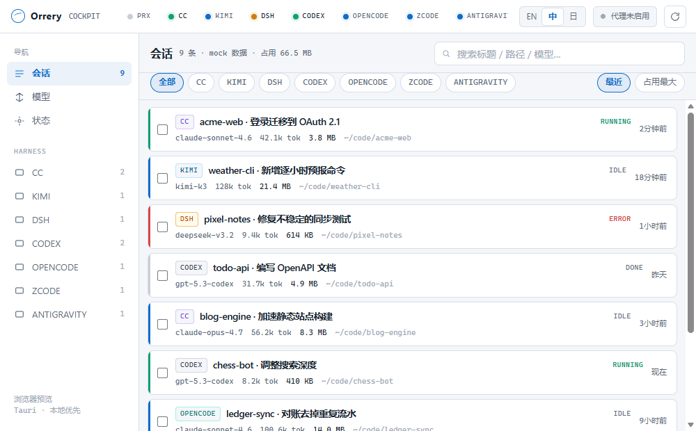
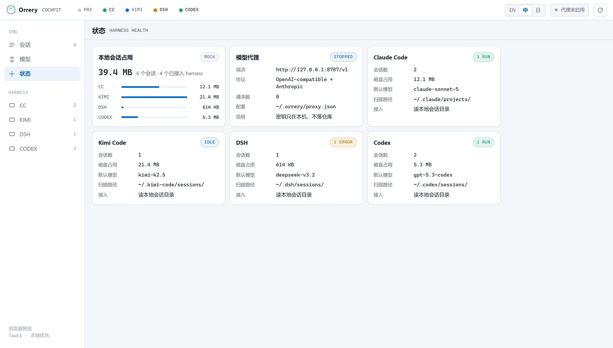
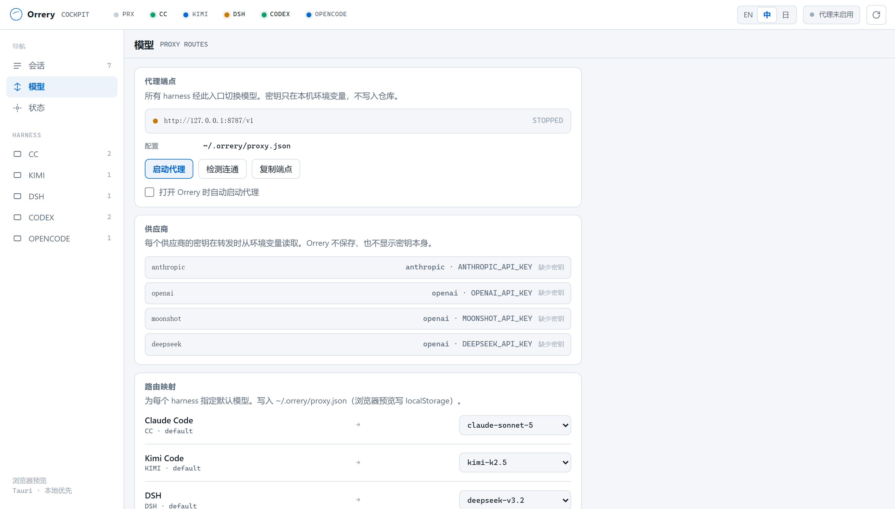
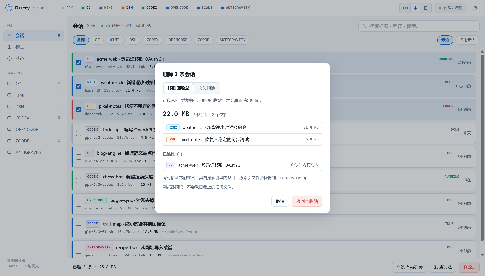

<div align="center">


# Orrery

**本地优先的 AI 编程 Agent 驾驶舱。**

把本机所有 Claude Code、Kimi Code、DSH（DeepSeek）、Codex、OpenCode、Z Code、Antigravity 会话收进一个窗口：token、磁盘占用、项目、子 agent 一眼看清。不要的会话可以直接删掉（Z Code 为只读），各个 harness 还能统一走一个本地模型代理。数据不出本机。

<p>
  <a href="https://github.com/arvelvale/orrery/releases/latest"></a>
  <a href="https://github.com/arvelvale/orrery/blob/main/LICENSE"></a>
  <a href="https://github.com/arvelvale/orrery/stargazers"></a>
  <a href="https://github.com/arvelvale/orrery/commits/main"></a>
</p>
<p>
  
  
  
  
  
  
</p>
<p>
  
  
  
  
</p>

[English](README.md) · **简体中文** · [日本語](README.ja.md)



</div>

> [!NOTE]
> 界面支持 English、简体中文、日本語，默认跟随系统语言，可随时在顶栏切换。演示动图与截图使用内置 mock 数据，项目均为虚构。

## 为什么做

同时用好几个 agent 工具的人，每天都会遇到同样的摩擦：

1. **会话散落各处**：每个工具各存各的 JSONL 或会话目录，格式互不相通，没法统一搜索、对比、恢复。
2. **用量看不见**：一个会话到底烧了多少 token？几百份对话记录吃掉多少磁盘？
3. **切换模型全靠手改**：每个工具各有各的环境变量和配置文件。

Orrery 只读取各工具本来就写在磁盘上的数据，汇总到一块面板上。不包装、不 fork、不重新实现任何 agent。

## 目前能用的

| 能力 | 状态 | 说明 |
|---|:---:|---|
| 会话中枢：Claude Code | ✅ | `~/.claude/projects`，子 agent 并入父会话 |
| 会话中枢：Kimi Code | ✅ | `~/.kimi-code/sessions`，兼容新旧两版 `state.json` |
| 会话中枢：DSH（DeepSeek） | ✅ | `~/.dsh/sessions`，zstd 压缩的事件日志，兼容 v0 / v3 格式 |
| 会话中枢：Codex | ✅ | `~/.codex/sessions`，同 id 的多个 rollout 合并，guardian 子 agent 并入父会话 |
| 会话中枢：OpenCode | ✅ | 只读 `$XDG_DATA_HOME/opencode` 或 `~/.local/share/opencode` 下的 `opencode.db`，递归合并子 agent；需要 session token 汇总字段 |
| 会话中枢：Z Code | ✅ | 只读 `~/.zcode/cli/db/db.sqlite`；体积包含每个会话的模型 I/O 日志、产物和图片缓存——这些才是它磁盘占用的大头 |
| 会话中枢：Antigravity CLI | ✅ | 只读 `~/.gemini/antigravity-cli/`：每个对话一个 SQLite，外加 `conversation_summaries.db`；用量从每次调用的 protobuf 记录里解出；用 `agy --conversation` 恢复 |
| 会话中枢：自己登记的 OpenCode 系工具 | ✅ | 在 `~/.orrery/harnesses.json` 里登记，Orrery 用同一套方式只读它的 SQLite——分支版本和自用版本都能接 |
| 准确的 token 统计 | ✅ | 按 API 调用去重，拆成输入 / 缓存写 / 缓存读 / 输出 |
| 单会话与各 harness 的磁盘占用 | ✅ | 状态页显示总计与按 harness 的拆分 |
| 按标题、路径、模型搜索 | ✅ | |
| 界面三语：English / 简体中文 / 日本語 | ✅ | 默认跟随系统语言，顶栏可切换 |
| 冷启动秒开 | ✅ | 解析结果落盘成索引，重启后只重读变动过的文件（188 个会话：5.5s → 0.12s）|
| 删除会话，腾出磁盘空间 | ✅ | 单条或多选，可按占用排序；回收站或永久删除；同时清理各工具自己的索引 |
| 本地模型代理（`127.0.0.1:8787`） | ✅ | 真实转发，OpenAI 与 Anthropic 两种形状，流式透传，可在应用里启停；已与真实供应商联调 |
| 在终端恢复会话 | ✅ | 在会话的工作目录起终端，执行该工具自己的恢复命令。DSH 只装了 web profile 时改为打开它的网页界面；自己登记的工具没有恢复命令 |



## token 是怎么算的

每个工具都按 API 调用记录用量，但没有一个能直接相加：

| | 数据来源 | 坑 | Orrery 的处理 |
|---|---|---|---|
| **Claude Code** | assistant 行的 `message.usage` | 流式输出按内容块拆成多行，每行重复同一份用量（某会话 4,034 行实为 1,558 次调用） | 按 `message.id` 去重，保留最后一行 |
| **Kimi Code** | `agents/*/wire.jsonl` 里的 `usage.record` 事件 | `usageScope: "session"` 是上下文压缩的独立调用，不是汇总 | 每条记录计一次 |
| **DSH** | 多帧 zstd 日志里 `assistant/message` 事件的 `data.usage` | 升级过的会话同时留着 v0 和 v3 两份同一段历史 | 两份都在时只读 v3 |
| **Codex** | `token_count` 事件，新版另有 `token_usage_record` | `total_token_usage` 按进程累计、恢复会话后清零；`input_tokens` 已包含缓存命中；旧的 `token_count` 漏记上下文压缩调用 | 按调用去重累加，有 `token_usage_record` 的时段以它为准，输入减去缓存命中 |

会话总量 = 主 agent + 全部子 agent。核对方式：

- **Claude Code**：在同一进程区间内和它自己的 `cost-state` 记账对比，输入、缓存读、输出三项完全一致。
- **DSH**：和 DSH 自己的投影缓存对比，截至缓存生成时的事件完全一致。
- **Codex**：同时有两本账的 12 个文件里 8 个完全一致，另外 4 个的差额正好是上下文压缩调用。

早期 Codex alpha 版本的会话只记了总数、没有分项，Orrery 把这部分单独显示为"未拆分"，不做猜测。

OpenCode 使用 SQLite `session.tokens_*` 累计值，推理是独立的一桶，并入 output；子 agent 递归并入根会话，API 调用次数暂不展示。独立 SQL 逐会话对账及 `opencode stats` 核对通过：53 条记录合并为 41 条会话、12 个子 agent；input 108.4M、cache read 1853.0M、cache write 1.2M 一致，output 4.7M 包含推理 1.3M。会话体积是 message/part/event 的 UTF-8 内容字节数，不代表 SQLite 可回收空间。已验证 Windows 桌面，macOS/Linux 尚未真机验证；现有截图早于此次接入。

已知限制：官方记账在 `--resume` 后会清零，所以 Orrery 改为从对话记录重新累加。官方记账还包含生成标题这类不写进对话记录的后台调用，所以 Orrery 算出的 Claude Code 总量可能少 1–5%。

## 快速开始

**只想用？**到[最新 release](https://github.com/arvelvale/orrery/releases/latest) 下载对应平台的安装包：

| 平台 | 文件 |
|---|---|
| Windows 10/11 x64 | `_x64-setup.exe`（装到用户目录，不需要管理员）或 `_x64_en-US.msi` |
| macOS 11+（Intel 与 Apple 芯片通用） | `_universal.dmg` |
| Linux x64 | `_amd64.AppImage`（免安装）或 `_amd64.deb` / `.rpm` |

都没有代码签名，首次运行要确认一次：Windows SmartScreen 点「更多信息 → 仍要运行」；macOS 右键点应用选「打开」，或执行 `xattr -cr /Applications/Orrery.app`；Linux 的 AppImage 先 `chmod +x`。

> [!NOTE]
> 作者日常用的是 Windows。macOS 和 Linux 的包由 CI 构建，三个平台的 clippy 与单元测试都过了，**但还没有人在 Mac 或 Linux 桌面上真正跑过这个应用**。那边出问题的话，开个 issue 附上终端里运行 `orrery` 的输出，非常欢迎。

**从源码构建 — 依赖**

- [Rust](https://rustup.rs)（Windows 上用 MSVC 工具链）
- Node.js 18+
- **Windows**：[Visual Studio Build Tools](https://aka.ms/vs/17/release/vs_BuildTools.exe)，勾选 MSVC 与 Windows SDK；WebView2（Windows 10/11 自带）
- **macOS**：Xcode 命令行工具
- **Linux**：`libwebkit2gtk-4.1-dev libappindicator3-dev librsvg2-dev patchelf libxdo-dev`

```powershell
git clone https://github.com/arvelvale/orrery.git
cd orrery
npm install
npm run dev        # 桌面应用，读取本机真实会话
```

只想看界面？不用装 Rust：

```powershell
npm run preview    # http://127.0.0.1:1420，mock 数据
```

> [!TIP]
> Rust 构建请在 PowerShell 里跑，不要用 Git Bash。Git 自带一个同名的 `link.exe`，它不是 MSVC 链接器。

## 目录结构

```text
orrery/
├─ ui/                      # index.html · styles.css · app.js · i18n.js（WebView 与浏览器共用）
├─ src-tauri/
│  └─ src/
│     ├─ adapters/
│     │  ├─ mod.rs          # SessionSummary、TokenUsage、缓存与共用工具
│     │  ├─ claude_code.rs
│     │  ├─ kimi_code.rs
│     │  ├─ dsh.rs
│     │  ├─ codex.rs
│     │  └─ cleanup.rs      # 删除会话与索引清理
│     ├─ proxy/             # 本地模型代理
│     │  ├─ mod.rs         # 启停与状态
│     │  ├─ config.rs      # 供应商与路由（~/.orrery/proxy.json）
│     │  ├─ server.rs      # HTTP 面与上游转发
│     │  └─ state.rs       # 计数、最近请求、最近错误
│     └─ lib.rs             # Tauri 命令
├─ scripts/preview.mjs      # 零依赖静态预览
├─ docs/                    # 设计文档
└─ DESIGN.md                # 视觉规格
```

## 本地模型代理

把 harness 的接口地址指到 `http://127.0.0.1:8787/v1`，Orrery 就会把请求转发到真实供应商。这样换模型只需在应用里点一下，不用改各个工具自己的配置。



| | |
|---|---|
| 接口 | `POST /v1/chat/completions`（OpenAI 形状）· `POST /v1/messages`（Anthropic 形状）· `GET /v1/models` · `GET /health` |
| 模型路由 | 请求带 `x-orrery-harness: <id>` 时，代理把 `model` 改写成「模型」页里给该 harness 选的模型；不带这个头就保留请求原本的模型 |
| 供应商选择 | 按模型名前缀匹配（`claude*` → anthropic，`kimi*` → moonshot…）。匹配不到就直接报错，绝不悄悄换一家顶上 |
| 流式 | SSE 逐块透传，不缓冲 |
| 密钥 | 每个供应商二选一。**环境变量**（推荐）：配置里只存变量名，转发时才读取。**在应用里填写**：以**明文**保存在 `~/.orrery/proxy.json`（macOS/Linux 上权限为仅本人可读的 `0600`）。密钥从不写进日志，状态列表只显示「是否已设置」。 |
| 监听 | 只允许回环地址，配置成非回环地址会被拒绝启动 |

```bash
# 1. 把密钥放进应用能读到的环境变量
setx ANTHROPIC_API_KEY sk-...        # Windows，设置后需重启 Orrery

# 2. 在「模型」页启动代理，然后把 harness 指过来
set ANTHROPIC_BASE_URL=http://127.0.0.1:8787
```

供应商、路由和监听地址都在 `~/.orrery/proxy.json`：

```json
{
  "listen": "127.0.0.1:8787",
  "auto_start": false,
  "routes": { "cc": "claude-opus-5" },
  "providers": {
    "anthropic": {
      "base_url": "https://api.anthropic.com/v1",
      "api_key_env": "ANTHROPIC_API_KEY",
      "wire": "anthropic",
      "model_prefixes": ["claude"]
    }
  }
}
```

## 删除会话

会话本质上就是磁盘上的文件，Orrery 可以帮你删掉不再需要的会话。删除前一定会弹出确认框，列出每条会话和能腾出的空间。



- **默认移到回收站。** 永久删除是单独的模式，还需要额外勾选确认。
- **正在用的会话受保护。** 10 分钟内有写入的，或正在被运行中的 Claude Code 使用的，会自动跳过。
- **同时清理各工具自己的索引**，不留死条目。改动前会把索引文件备份到 `~/.orrery/backups/`。
- **Codex 通过官方的 `codex delete` 删除**，会一并清理 Codex 的历史数据库。Orrery 从不直接写其他工具的数据库。
- **OpenCode 通过官方的 `opencode session delete` 删除**，子 agent 一并删除。OpenCode 没有回收站，所以回收站模式下会先把每条会话导出到 `~/.orrery/exports/`，旁边的 `RESTORE.txt` 写好了 `opencode import` 恢复命令。OpenCode 的数据库文件不会马上变小，空出的空间由它自己复用。
- **正在 agy 里打开的 Antigravity 对话会跳过。** 只移走对话自己的文件，不碰 agy 的摘要库，所以它的历史列表里可能还留着标题。
- 路径由后端根据会话 id 解析，并且必须位于该工具的数据目录之内。

| 工具 | 删除的文件 | 移除的索引条目 |
|---|---|---|
| Claude Code | `projects/<p>/<id>.jsonl`、`projects/<p>/<id>/`、`file-history/<id>/`、`session-env/<id>/`、`tasks/<id>/` | — |
| Kimi Code | `sessions/<ws>/<id>/` | `session_index.jsonl`、`file-history/<ws>` |
| DSH | `sessions/<ws>/<id>/` 及其投影缓存 | `storages/workspace.json` |
| Codex | 该会话的 rollout 及其子 agent 的 rollout | Codex 数据库（经 `codex delete`）、`session_index.jsonl` |
| OpenCode | —（全在 `opencode.db` 里） | 会话及子 agent，经 `opencode session delete` |
| Z Code | 暂不支持（只读） | 不修改 |
| Antigravity | `conversations/<id>.db`（及 `-wal`/`-shm`）、`brain/<id>/`、`annotations/<id>.pbtxt`，子对话同理 | —（agy 自己的历史列表可能还留着标题，打开只会开新对话） |
| 登记的工具 | 暂不支持（只读） | 不修改 |

> [!TIP]
> 删除某个工具的会话前，建议先关闭这个工具。运行中的 Kimi Code 或 Codex 可能会把删掉的条目重新写回索引。

## 隐私

- 只有在你删除会话时，Orrery 才会写入各 harness 的目录，具体如上。
- 它自己的文件都在 `~/.orrery/`：路由配置（**包括你在应用里填写的 API Key，明文保存**）、索引备份，以及 `index.json`——会话解析结果（标题、路径、token 数）的缓存，用来让重启后秒开。随时可以删，下次扫描会重建。
- 不联网、无遥测，代理只监听 `127.0.0.1`。
- 可能含粘贴密钥的字段（如 Kimi 的 `lastPrompt`）不读取。

## 路线图

- [x] Tauri 2 桌面壳与会话中枢
- [x] Claude Code、Kimi Code、DSH、Codex 适配器
- [x] token 与磁盘占用统计
- [x] 本地模型代理（真实转发）
- [x] 持久化索引，冷启动秒开
- [x] 在对应 CLI 里恢复会话
- [ ] 托盘、全局快捷键、安装包

设计文档：[项目定位](docs/00-项目定位.md) · [架构与技术路线](docs/01-架构与技术路线.md) · [MVP 路线图](docs/02-MVP路线图.md)
