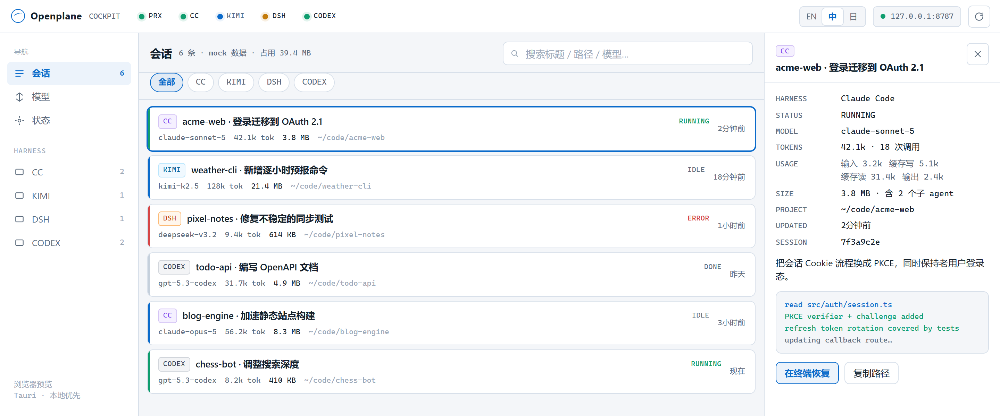

<div align="center">


# Openplane

**本地优先的 AI 编程 Agent 驾驶舱。**

把本机所有 Claude Code、Kimi Code、DSH（DeepSeek）、Codex 会话收进一个窗口：token、磁盘占用、项目、子 agent 一眼看清。数据不出本机。

<p>
  <a href="https://github.com/arvelvale/openplane/blob/main/LICENSE"></a>
  <a href="https://github.com/arvelvale/openplane/stargazers"></a>
  <a href="https://github.com/arvelvale/openplane/commits/main"></a>
</p>
<p>
  
  
  
  
  
  
</p>
<p>
  
  
  
  
</p>

[English](README.md) · **简体中文** · [日本語](README.ja.md)



</div>

> [!NOTE]
> 界面支持 English、简体中文、日本語，默认跟随系统语言，可随时在顶栏切换。截图使用内置 mock 数据，项目均为虚构。

## 为什么做

同时用好几个 agent 工具的人，每天都会遇到同样的摩擦：

1. **会话散落各处**：每个工具各存各的 JSONL 或会话目录，格式互不相通，没法统一搜索、对比、恢复。
2. **用量看不见**：一个会话到底烧了多少 token？几百份对话记录吃掉多少磁盘？
3. **切换模型全靠手改**：每个工具各有各的环境变量和配置文件。

Openplane 只读取各工具本来就写在磁盘上的数据，汇总到一块面板上。不包装、不 fork、不重新实现任何 agent。

## 目前能用的

| 能力 | 状态 | 说明 |
|---|:---:|---|
| 会话中枢：Claude Code | ✅ | `~/.claude/projects`，子 agent 并入父会话 |
| 会话中枢：Kimi Code | ✅ | `~/.kimi-code/sessions`，兼容新旧两版 `state.json` |
| 会话中枢：DSH（DeepSeek） | ✅ | `~/.dsh/sessions`，zstd 压缩的事件日志，兼容 v0 / v3 格式 |
| 会话中枢：Codex | ✅ | `~/.codex/sessions`，同 id 的多个 rollout 合并，guardian 子 agent 并入父会话 |
| 准确的 token 统计 | ✅ | 按 API 调用去重，拆成输入 / 缓存写 / 缓存读 / 输出 |
| 单会话与各 harness 的磁盘占用 | ✅ | 状态页显示总计与按 harness 的拆分 |
| 按标题、路径、模型搜索 | ✅ | |
| 界面三语：English / 简体中文 / 日本語 | ✅ | 默认跟随系统语言，顶栏可切换 |
| 增量刷新 | ✅ | 没变的文件直接走内存缓存 |
| 本地模型代理（`127.0.0.1:8787`） | ⏳ | 目前只有路由配置和探活，还不转发请求 |
| 在终端恢复会话 | ⏳ | 目前只打开会话目录 |


## token 是怎么算的

每个工具都按 API 调用记录用量，但没有一个能直接相加：

| | 数据来源 | 坑 | Openplane 的处理 |
|---|---|---|---|
| **Claude Code** | assistant 行的 `message.usage` | 流式输出按内容块拆成多行，每行重复同一份用量（某会话 4,034 行实为 1,558 次调用） | 按 `message.id` 去重，保留最后一行 |
| **Kimi Code** | `agents/*/wire.jsonl` 里的 `usage.record` 事件 | `usageScope: "session"` 是上下文压缩的独立调用，不是汇总 | 每条记录计一次 |
| **DSH** | 多帧 zstd 日志里 `assistant/message` 事件的 `data.usage` | 升级过的会话同时留着 v0 和 v3 两份同一段历史 | 两份都在时只读 v3 |
| **Codex** | `token_count` 事件，新版另有 `token_usage_record` | `total_token_usage` 按进程累计、恢复会话后清零；`input_tokens` 已包含缓存命中；旧的 `token_count` 漏记上下文压缩调用 | 按调用去重累加，有 `token_usage_record` 的时段以它为准，输入减去缓存命中 |

会话总量 = 主 agent + 全部子 agent。核对方式：

- **Claude Code**：在同一进程区间内和它自己的 `cost-state` 记账对比，输入、缓存读、输出三项完全一致。
- **DSH**：和 DSH 自己的投影缓存对比，截至缓存生成时的事件完全一致。
- **Codex**：同时有两本账的 12 个文件里 8 个完全一致，另外 4 个的差额正好是上下文压缩调用。

早期 Codex alpha 版本的会话只记了总数、没有分项，Openplane 把这部分单独显示为"未拆分"，不做猜测。

已知限制：官方记账在 `--resume` 后会清零，所以 Openplane 改为从对话记录重新累加。官方记账还包含生成标题这类不写进对话记录的后台调用，所以 Openplane 算出的 Claude Code 总量可能少 1–5%。

## 快速开始

**依赖（Windows）**

- [Rust](https://rustup.rs)（MSVC 工具链）
- [Visual Studio Build Tools](https://aka.ms/vs/17/release/vs_BuildTools.exe)，勾选 MSVC 与 Windows SDK
- Node.js 18+
- WebView2（Windows 10/11 自带）

```powershell
git clone https://github.com/arvelvale/openplane.git
cd openplane
npm install
npm run dev        # 桌面应用，读取本机真实会话
```

只想看界面？不用装 Rust：

```powershell
npm run preview    # http://127.0.0.1:1420，mock 数据
```

> [!TIP]
> Rust 构建请在 PowerShell 里跑，不要用 Git Bash。Git 自带一个同名的 `link.exe`，它不是 MSVC 链接器。

## 目录结构

```text
openplane/
├─ ui/                      # index.html · styles.css · app.js · i18n.js（WebView 与浏览器共用）
├─ src-tauri/
│  └─ src/
│     ├─ adapters/
│     │  ├─ mod.rs          # SessionSummary、TokenUsage、缓存与共用工具
│     │  ├─ claude_code.rs
│     │  └─ kimi_code.rs
│     ├─ proxy.rs           # 8787 探活 + ~/.openplane/proxy.json
│     └─ lib.rs             # Tauri 命令
├─ scripts/preview.mjs      # 零依赖静态预览
├─ docs/                    # 设计文档
└─ DESIGN.md                # 视觉规格
```

## 隐私

- 只读：从不写入任何 harness 的会话目录。
- 唯一会写的文件是 `~/.openplane/proxy.json`，也就是你的路由配置。
- 不联网、无遥测，代理只监听 `127.0.0.1`。
- 可能含粘贴密钥的字段（如 Kimi 的 `lastPrompt`）不读取。

## 路线图

- [x] Tauri 2 桌面壳与会话中枢
- [x] Claude Code、Kimi Code、DSH、Codex 适配器
- [x] token 与磁盘占用统计
- [ ] 持久化索引，冷启动秒开
- [ ] 真正的 OpenAI 兼容 / Anthropic 形状本地代理
- [ ] 在对应 CLI 里恢复会话
- [ ] 托盘、全局快捷键、安装包

设计文档：[项目定位](docs/00-项目定位.md) · [架构与技术路线](docs/01-架构与技术路线.md) · [MVP 路线图](docs/02-MVP路线图.md)
